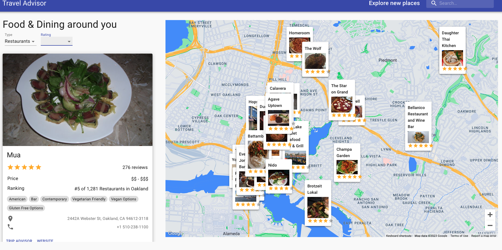

Travel Companion Application using Google Maps

This is a Travel Companion Application that leverages Google Maps API, Geolocation, and specialized Rapid APIs to provide users with a seamless travel experience. The application allows users to search for places, fetch restaurants, hotels, and attractions based on their location, apply data filtering, and much more.
Technologies Used

    Google Maps API
    Geolocation
    RapidAPI
    React.js
    Material UI

Features

    Search for places using Google Maps API
    Fetch restaurants, hotels, and attractions based on location from specialized Rapid APIs
    Apply data filtering for better results
    Use advanced React Best Practices such as folder & file structure, hooks, and refs
    Create an intuitive user interface using Material UI
    Work with Google Maps API
    Fetch data from unlimited sources using RapidAPI

Installation

    Clone the repository
    Install dependencies with yarn install 
    Run the app with yarn start